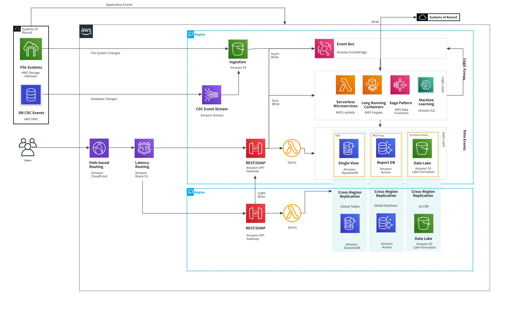
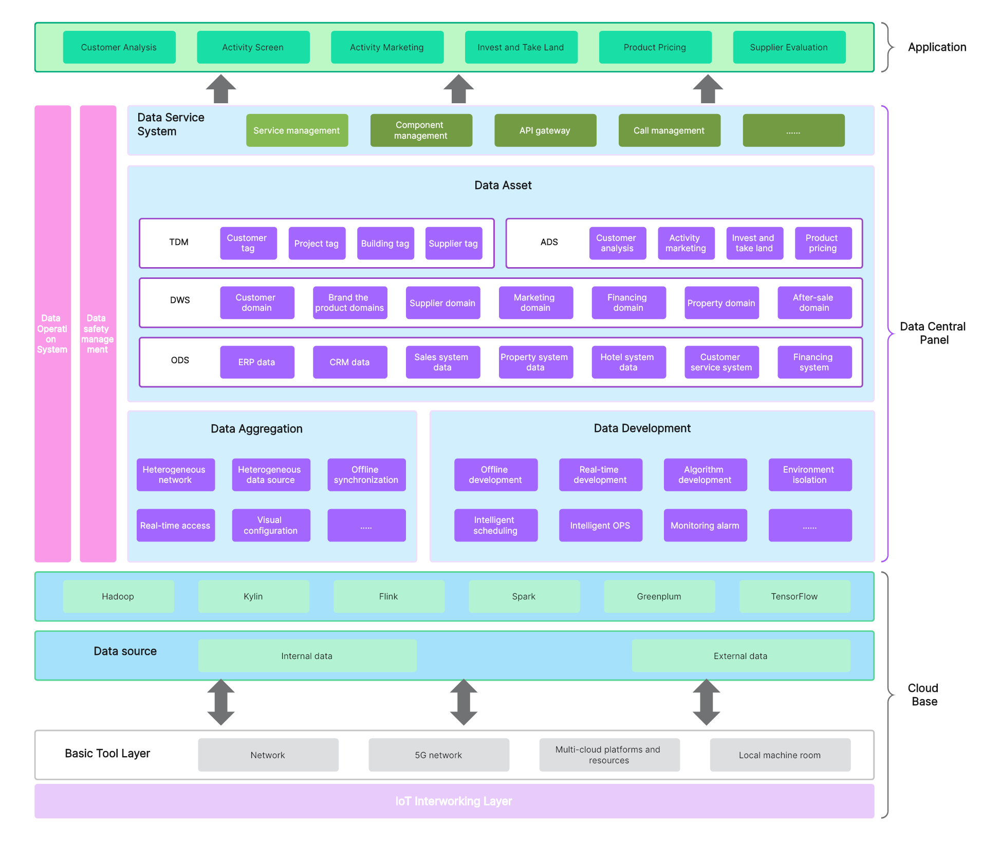

---
hide:
  - navigation
  - toc
---

<h1 class="pg-title-s2"></h1>

  

    
  

  

    

      

        <button class="dgrm-tab-nav-item active" data-tab-body="dgrm-tab-body-current-state">Current State</button>
        <button class="dgrm-tab-nav-item" data-tab-body="dgrm-tab-body-future-state">Future State</button>
        <button class="dgrm-tab-nav-item" data-tab-body="dgrm-tab-body-document">Documents</button>
      

      

        

          

            

              
            

          

        

      

      

        

          

            

              
            

          

        

      

      

        

          <a href="../images/sample-arch-2.png" target="_blank">Sample Document 1</a>
          <a href="../images/sample-arch-2.png" target="_blank">Sample Document 2</a>
          <a href="../images/sample-arch-2.png" target="_blank">Sample Document 3</a>
        

      

    

  

